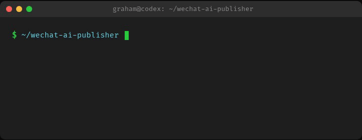
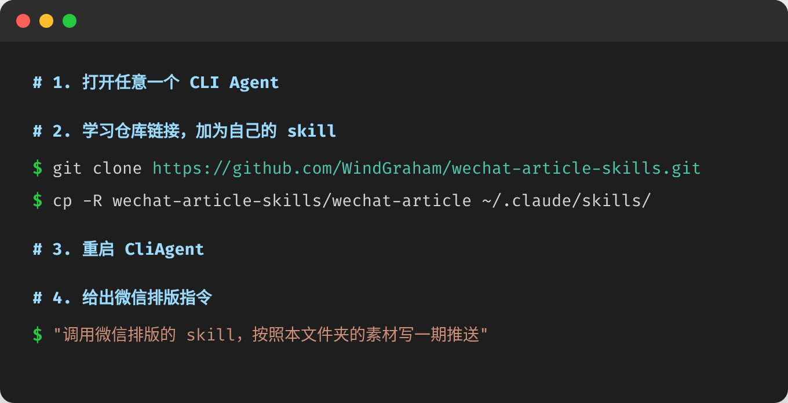

<p align="center">
  
</p>

<h1 align="center">WeChat Article Skill</h1>

<p align="center">
  <strong>AI-Powered WeChat Official Account HTML Generator & Auto-Publisher</strong>
</p>

<p align="center">
  面向 AI Agent 的微信公众号文章排版技能包 — 从 HTML 生成到自动发布，一站式解决。
</p>

<p align="center">
  <a href="#-快速开始">快速开始</a> •
  <a href="#-核心功能">核心功能</a> •
  <a href="#-使用示例">使用示例</a>
</p>

---

## 🎬 快速开始

<p align="center">
  
</p>

<p align="center">
  
</p>

---

## ✨ 核心功能

| 功能 | 说明 |
|:---|:---|
| 🎨 **智能排版** | 根据内容自动生成移动端优先（375px）的微信公众号 HTML |
| 📐 **精细组件** | 标题区、卡片、图片框、分割线、引用块、错落布局、三图皇冠等 |
| 🧭 **强制工作流** | 先确认风格、发布方式、布局方式，再生成 HTML |
| 🧩 **可视化布局草稿** | 本地拖拽工具表达空间意图，AI 转成微信兼容 HTML |
| 🖼️ **图片预检与处理** | 本地图片自动上传图床 / 微信 CDN |
| 🧪 **自查流程** | 代码合规、视觉一致、内容完整三轮检查 |
| 🧷 **Chrome 注入扩展** | 从本地 HTML 捕获内容注入公众号编辑器 |
| 🤖 **自动发布** | 微信公众号 API 直连草稿箱 |
| 🔄 **版本管理** | Git 本地追踪排版迭代 |
| 📸 **视觉检查** | 浏览器截图验证移动端布局 |

---

## 📊 能力对比

| 维度 | **本 Skill** | 其他方案 |
|:---|:---|:---|
| AI 智能排版 | ✅ 原生驱动，理解内容语义 | ❌ 手动操作或仅格式转换 |
| 视觉精细度 | ✅ 层叠/错落/异形/阴影/圆角 | ⚠️ 模板固定或基础布局 |
| 图片处理 | ✅ 自动上传微信 CDN | ⚠️ 依赖外部图床或手动上传 |
| 自动发布 | ✅ API 直连草稿箱 | ❌ 需手动粘贴 |
| 移动端适配 | ✅ 375px 根容器，真机级还原 | ⚠️ 需自行调整 |
| 使用成本 | ✅ 开源免费 | ❌ 付费订阅或按量计费 |

---

## 📝 使用示例

### 基础排版

```text
使用 $wechat-article，把下面这篇文章排成适合微信公众号编辑器粘贴的 HTML。
主题色用绿色，正文 16px，首行缩进 2em。
```

### Chrome 扩展注入

```text
使用 $wechat-article，生成可用 Chrome 扩展注入到公众号后台的 HTML。
```

扩展位置：`wechat-article/tools/wechat-inject-extension/`

### 自动发布

```text
使用 $wechat-article，自动发布这篇文章到公众号草稿箱。
AppID: wx1234567890abcdef
AppSecret: your_appsecret_here
封面图: /path/to/thumb.jpg
作者: 作者姓名
```

**前置条件**：微信公众号 AppID + AppSecret，服务器 IP 加入白名单，`pip install requests`

```python
from scripts.auto_publish import publish_article

media_id = publish_article(
    appid="your_appid",
    appsecret="your_appsecret",
    title="文章标题",
    html_content=html_string,
    thumb_source="/path/to/thumb.jpg",
    author="作者姓名"
)
```

---

## 📁 项目结构

```text
wechat-article/
  📄 SKILL.md                 # 主技能文档
  🤖 agents/openai.yaml       # OpenAI 兼容配置
  🎨 assets/template.html     # 起始模板
  📜 scripts/auto_publish.py  # 自动发布脚本
  🧰 tools/
     ├── layout-composer.html       # 本地拖拽草稿工具
     └── wechat-inject-extension/   # Chrome 注入扩展
  📚 references/               # 排版规范、兼容规则、检查清单
```

---

## 🤝 贡献

欢迎提交 Issue 和 PR！

- 🎨 新的排版组件和视觉模式
- 🌍 多语言支持
- 📚 文档改进
- 🐛 Bug 修复
- ✨ 新功能（定时发布、多账号支持等）

---

## 📄 开源协议

[MIT License](LICENSE)

---

<p align="center">
  <sub>Made with ❤️ for WeChat content creators</sub>
</p>
