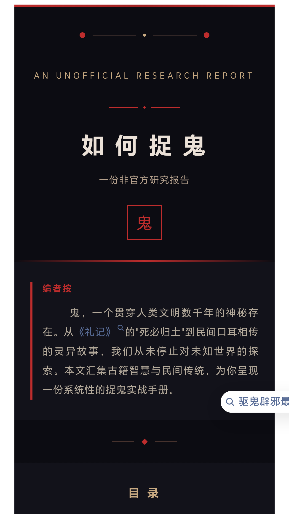
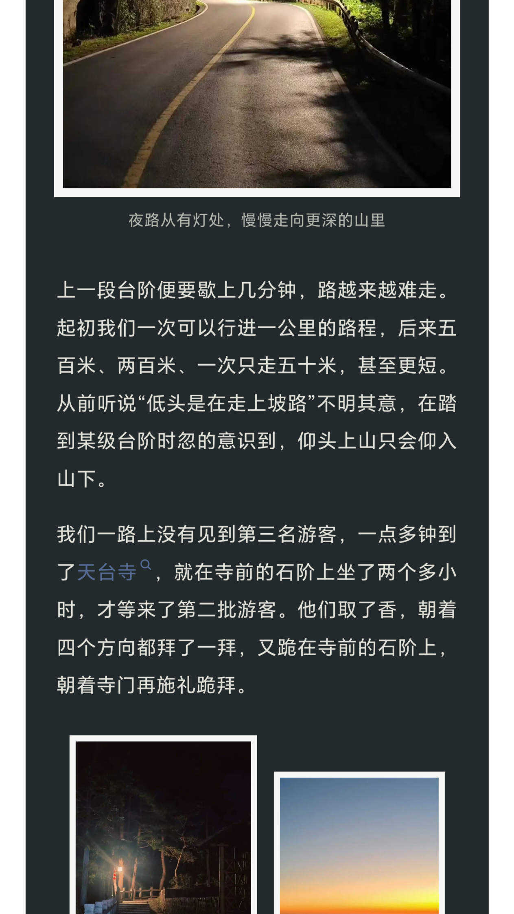
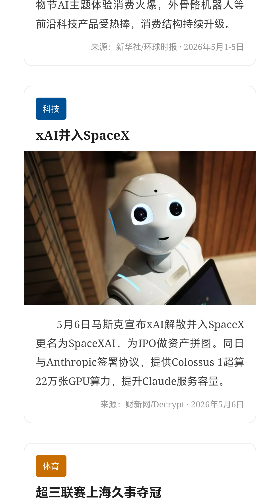
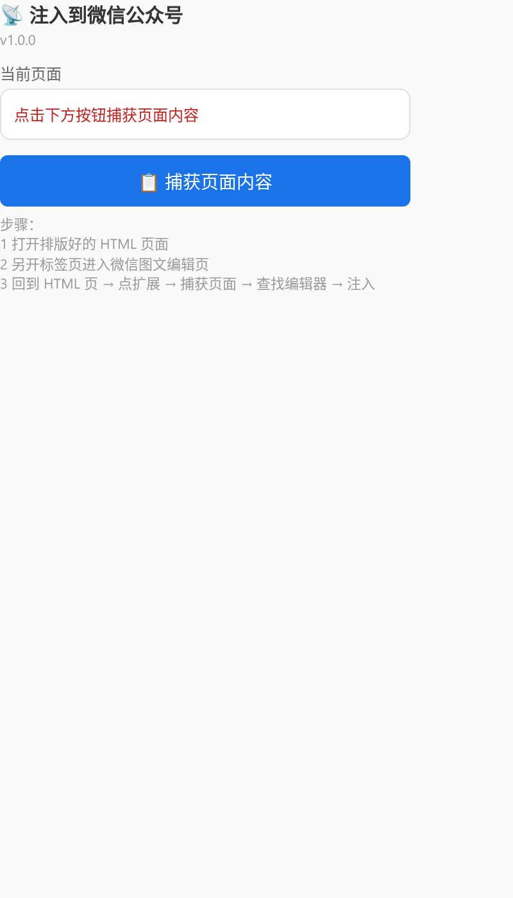

<p align="center">
  
</p>

<h1 align="center">WeChat Article Skill</h1>

<p align="center">
  <strong>AI-Powered WeChat Official Account HTML Generator & Auto-Publisher</strong>
</p>

<p align="center">
  面向 AI Agent 的微信公众号文章排版技能包 — 从 HTML 生成到自动发布，一站式解决。
</p>

<p align="center">
  <a href="#-快速开始">快速开始</a> •
  <a href="#-效果展示">效果展示</a> •
  <a href="#-能力对比">能力对比</a> •
  <a href="#-安装">安装</a> •
  <a href="#-使用示例">使用示例</a>
</p>

---

## 🎬 三步上手

<p align="center">
  
</p>

```bash
# 1. 克隆仓库并添加为 skill
git clone https://github.com/WindGraham/wechat-article-skills.git
cp -R wechat-article-skills/wechat-article ~/.claude/skills/

# 2. 重启你的 CLI Agent

# 3. 一句话开始排版
"调用微信排版的 skill，按照本文件夹的素材写一期推送"
```

<p align="center">
  
</p>

---

## 🎨 效果展示

三种截然不同的风格，全部由 AI 生成：

<p align="center">
  
  &nbsp;&nbsp;
  
  &nbsp;&nbsp;
  
</p>

<p align="center">
  <sub>暗黑中国风 · 文艺散文风 · 新闻简报风</sub>
</p>

---

## ✨ 核心功能

| 功能 | 说明 |
|:---|:---|
| 🎨 **智能排版** | 根据内容自动生成移动端优先（375px）的微信公众号 HTML |
| 📐 **精细组件** | 标题区、卡片、图片框、分割线、引用块、错落布局、三图皇冠等 |
| 🧭 **强制工作流** | 先确认风格、发布方式、布局方式，再生成 HTML，避免无约束乱排版 |
| 🧩 **可视化布局草稿** | 使用本地拖拽工具表达空间意图，再由 AI 转成微信兼容 HTML |
| 🖼️ **图片预检与处理** | 本地图片上传图床 / 微信 CDN，最终交付前验证图片 URL 可访问 |
| 🧪 **自查流程** | 代码合规、视觉一致、内容完整三轮检查，减少微信编辑器兼容问题 |
| 🧷 **Chrome 注入扩展** | 可从本地 HTML 页面捕获内容并注入到微信公众号编辑器 |
| 🤖 **自动发布** | 通过微信公众号 API 创建/更新草稿箱，支持封面、作者、摘要参数 |
| 🔄 **版本管理** | 本地 Git 追踪排版迭代，每轮调整都有记录 |
| 📸 **视觉检查** | 浏览器截图验证布局，防止重叠、溢出、空白 |

---

## 🚀 快速开始

### 方式一：手动粘贴（Manual Paste）

```text
使用 $wechat-article，把下面这篇文章排成公众号 HTML。主题色用绿色，正文 16px。
```

生成后：浏览器打开 → **Ctrl+A** → **Ctrl+C** → mp.weixin.qq.com → **Ctrl+V**

### 方式二：Chrome 扩展注入（Extension Inject）

```text
使用 $wechat-article，生成一份可在浏览器打开的公众号 HTML。
```

生成后：浏览器打开 HTML → 打开微信公众号图文编辑页 → 使用 `tools/wechat-inject-extension` 捕获页面并注入编辑器。

<p align="center">
  
</p>

### 方式三：自动发布（Auto-Publish）

```text
使用 $wechat-article，自动发布这篇文章到公众号草稿箱。AppID: xxx, AppSecret: xxx
封面图: /path/to/thumb.jpg
作者: 作者姓名
```

自动创建/更新草稿，正文图片上传微信 CDN，中文编码正确处理。封面图和作者需要用户明确提供；摘要可提供，也可由脚本从正文自动生成。

---

## 📊 能力对比

| 维度 | **本 Skill** | 其他方案 |
|:---|:---|:---|
| **AI 智能排版** | ✅ 原生驱动，理解内容语义 | ❌ 手动操作或仅格式转换 |
| **视觉精细度** | ✅ 层叠/错落/异形/阴影/圆角 | ⚠️ 模板固定或基础布局 |
| **组件丰富度** | ✅ 标题区/卡片/图片框/分割线/引用/落款/双栏/三栏/皇冠布局 | ⚠️ 需手动组合或仅基础元素 |
| **图片处理** | ✅ 自动上传微信 CDN，长期稳定 | ⚠️ 依赖外部图床或需手动上传 |
| **中文编码** | ✅ UTF-8 原生，不乱码 | ⚠️ 可能出现 Unicode 转义 |
| **自动发布** | ✅ API 直连草稿箱 | ❌ 需手动粘贴或仅生成 HTML |
| **移动端适配** | ✅ 375px 根容器，真机级还原 | ⚠️ 需自行调整或无法保证 |
| **版本管理** | ✅ Git 本地追踪迭代 | ❌ 无 |
| **视觉检查** | ✅ 自动化截图验证 | ❌ 人工检查 |
| **使用成本** | ✅ 开源免费 | ❌ 付费订阅或按量计费 |

### 🎨 排版优势详解

**为什么我们的排版更好看？**

| 我们的能力 | 效果 |
|:---|:---|
| **层叠布局** | 图片+文字卡片重叠，杂志级视觉冲击 |
| **错落网格** | 左高右低/左低右高，打破呆板对称 |
| **异形装饰** | 菱形、叶子形、圆形贴纸，细节精致 |
| **负边距重叠** | 标题压在大图上，节省空间有层次 |
| **纹理背景** | 色块+纹理，告别纯白单调 |
| **四角边框** | 图片四边有色条，复古又现代 |
| **渐变分割线** | 不是一条线，是视觉节奏点 |
| **阴影层次** | 卡片浮起感，阅读有呼吸感 |

**一句话总结**：

> 别人给的是「能用的排版」，我们给的是「好看的排版」。
>
> 别人是工具，我们是设计师。

---

## 📁 目录结构

```text
wechat-article/
  📄 SKILL.md                    # 主技能文档（工作流、规则、API）
  🤖 agents/openai.yaml          # OpenAI 兼容配置
  🎨 assets/
     └── template.html           # 起始模板
  📜 scripts/
     └── auto_publish.py         # 自动发布脚本
  🧰 tools/
     ├── layout-composer.html    # 本地拖拽草稿工具（非最终公众号 HTML）
     ├── save-layout-server.py   # 接收布局草稿 JSON 的本地服务
     └── wechat-inject-extension/ # Chrome 注入扩展
  📚 references/
     ├── auto-publish.md         # 自动发布文档
     ├── background-color-guide.md # 微信背景色限制与替代方案
     ├── decorative-patterns.md  # 装饰模式
     ├── editor-features.md      # 编辑器能力说明
     ├── formatting-guide.md     # 排版规范
     ├── generation-checklist.md # 生成检查清单
     ├── image-hosting-preflight.md # 图片托管预检
     ├── image-url-workflow.md   # 图片处理流程
     ├── inline-block-safety.md  # 双栏/多栏安全规则
     ├── interaction-workflow.md # 用户协作流程
     ├── refined-layout-blocks.md # 精细排版组件
     ├── screenshot-check.md     # 截图检查流程
     ├── self-check-workflow.md  # 三轮自查流程
     ├── svg-compatibility.md    # SVG/SMIL 兼容矩阵
     ├── visual-layout-workflow.md # 可视化布局草稿流程
     └── wechat-rules.md         # 微信兼容性规则
```

> `layout-composer.html` 只是本地可视化草稿工具，用于表达空间布局意图；它输出的 JSON 需要再由 AI 拟合成微信安全的内联样式 HTML，不能直接粘贴到公众号编辑器。

---

## 🛠️ 安装

### 方式一：本地 Skills 目录

```bash
# Codex
 cp -R wechat-article "${CODEX_HOME:-$HOME/.codex}/skills/"

# OpenClaw
 cp -R wechat-article "${OPENCLAW_HOME:-$HOME/.openclaw}/skills/"
```

### 方式二：Skill Installer

```text
$skill-installer install https://github.com/WindGraham/wechat-article-skills/tree/main/wechat-article
```

### 方式三：Git Clone

```bash
git clone https://github.com/WindGraham/wechat-article-skills.git
cd wechat-article-skills
```

> ⚠️ 重启 CLI Agent 后 skill 元数据才会加载。

---

## 🔄 更新

```bash
cd wechat-article-skills
git pull
cp -R wechat-article "${SKILLS_DIR}/"
```

---

## 📝 使用示例

### 标准工作流

Skill 会先确认以下信息，再开始生成 HTML：

1. 风格选择：色彩方向、精细程度、图片样式、开头形式、正文习惯
2. 发布方式：手动粘贴、Chrome 扩展注入、API 自动发布
3. 布局方式：AI 决定、参考截图、可视化拖拽草稿
4. 图片方案：本地图片上传、外部 HTTPS URL、微信 CDN

### 基础排版

```text
使用 $wechat-article，把下面这篇文章排成适合微信公众号编辑器粘贴的 HTML。
主题色用绿色，正文 16px，首行缩进 2em，图片先用占位 URL。
```

### 参考风格

```text
使用 $wechat-article，参考我上传的截图风格，把下面这篇文章排成公众号 HTML。
图片先用占位 URL，无法在微信里精确实现的效果请用兼容写法近似。
```

### 可视化布局草稿

```text
使用 $wechat-article，我想先用拖拽工具安排大致版面，再让你生成公众号 HTML。
```

流程：打开 `wechat-article/tools/layout-composer.html` → 拖拽组件 → 保存布局 JSON → AI 读取空间关系并生成微信安全 HTML。

### Chrome 扩展注入

```text
使用 $wechat-article，生成可用 Chrome 扩展注入到公众号后台的 HTML。
```

扩展位置：`wechat-article/tools/wechat-inject-extension/`

### 自动发布

```text
使用 $wechat-article，自动发布这篇文章到公众号草稿箱。
AppID: wx1234567890abcdef
AppSecret: your_appsecret_here
封面图: /path/to/thumb.jpg
作者: 作者姓名
摘要: 可选；不填时从正文自动生成
```

---

## ⚙️ 自动发布配置

### 前置条件

1. 微信公众号 AppID + AppSecret
2. 服务器 IP 加入白名单（微信公众平台 → 开发 → 基本配置 → IP 白名单）
3. 安装 `requests`：`pip install requests`

### 配置项

| 配置 | 说明 |
|:---|:---|
| `AppID` | 微信公众号应用 ID |
| `AppSecret` | 微信公众号应用密钥 |
| `thumb_source` | 必填，封面图本地路径或 HTTPS URL，用于上传 `thumb_media_id` |
| `author` | 必填，文章作者；脚本不会自动编造 |
| `digest` | 可选，文章摘要；不传时从正文自动生成，最长 120 字 |
| `DRAFT_ID_FILE` | `.wechat_draft_id`（自动保存草稿 ID） |

### Python 调用示例

```python
from scripts.auto_publish import publish_article

media_id = publish_article(
    appid="your_appid",
    appsecret="your_appsecret",
    title="文章标题",
    html_content=html_string,
    thumb_source="/path/to/thumb.jpg",
    author="作者姓名",
    digest="可选摘要；不传时脚本会从正文自动生成"
)
```

---

## 🎯 适用场景

- ✅ 文章草稿、通知、活动推送、图文内容 → 公众号 HTML
- ✅ 不打开可视化编辑器，直接生成移动端排版
- ✅ 在公众号富文本限制内做标题区、信息卡、金句卡、图片框
- ✅ 参考截图风格，生成相近的公众号排版
- ✅ 用拖拽工具表达布局意图，再生成微信兼容 HTML
- ✅ 用 Chrome 扩展从本地 HTML 注入到公众号编辑器
- ✅ CI/CD 自动化发布流程集成
- ✅ 批量内容生产，保持排版一致性

---

## 🔎 检查与交付

生成或发布前，skill 会按文档执行检查：

- **图片预检**：本地图片先上传，外部 URL 验证可访问，最终 HTML 不保留本地路径。
- **截图检查**：用 430px 宽度浏览器截图检查移动端布局。
- **代码合规检查**：检查根容器、内联样式、禁用标签、图片样式、多栏宽度等。
- **视觉一致检查**：检查主题色、字号层级、间距、圆角、重叠和溢出。
- **内容完整检查**：检查原文内容、图片、占位符、作者/来源等元数据。

---

## 📋 输出规范

生成的 HTML 符合以下要求：

- ✅ 只使用内联样式（`style="..."`）
- ✅ 根容器 `width: 100%; max-width: 375px; margin-left: auto; margin-right: auto;`
- ✅ 优先用 `<section>` 做布局容器
- ✅ 避免 `<script>`、`<style>`、`<iframe>`、`<table>`
- ✅ 图片使用用户提供的 URL 或中性占位 URL
- ✅ 字号、行距、缩进、落款按用户习惯调整
- ✅ 不编造组织名称、作者姓名、邮箱、二维码
- ✅ 最终交付前确认图片是 public HTTPS URL 或微信 CDN URL
- ✅ 默认使用 `inline-block` 做多栏；只有明确需要时才使用 flex

---

## 🤝 贡献

欢迎提交 Issue 和 PR！

### 贡献方向

- 🎨 新的排版组件和视觉模式
- 🌍 多语言支持
- 📚 文档改进
- 🐛 Bug 修复
- ✨ 新功能（如：定时发布、多账号支持）

---

## 📄 开源协议

[MIT License](LICENSE)

```
MIT License

Copyright (c) 2025 WindGraham

Permission is hereby granted, free of charge, to any person obtaining a copy
of this software and associated documentation files (the "Software"), to deal
in the Software without restriction, including without limitation the rights
to use, copy, modify, merge, publish, distribute, sublicense, and/or sell
copies of the Software, and to permit persons to whom the Software is
furnished to do so, subject to the following conditions:

The above copyright notice and this permission notice shall be included in all
copies or substantial portions of the Software.

THE SOFTWARE IS PROVIDED "AS IS", WITHOUT WARRANTY OF ANY KIND, EXPRESS OR
IMPLIED, INCLUDING BUT NOT LIMITED TO THE WARRANTIES OF MERCHANTABILITY,
FITNESS FOR A PARTICULAR PURPOSE AND NONINFRINGEMENT. IN NO EVENT SHALL THE
AUTHORS OR COPYRIGHT HOLDERS BE LIABLE FOR ANY CLAIM, DAMAGES OR OTHER
LIABILITY, WHETHER IN AN ACTION OF CONTRACT, TORT OR OTHERWISE, ARISING FROM,
OUT OF OR IN CONNECTION WITH THE SOFTWARE OR THE USE OR OTHER DEALINGS IN THE
SOFTWARE.
```

---

## 🙏 致谢

- 微信团队提供公众号平台
- 开源社区的各种排版灵感
- AI Agent 工具生态的建设者们

---

<p align="center">
  <sub>Made with ❤️ for WeChat content creators</sub>
</p>
